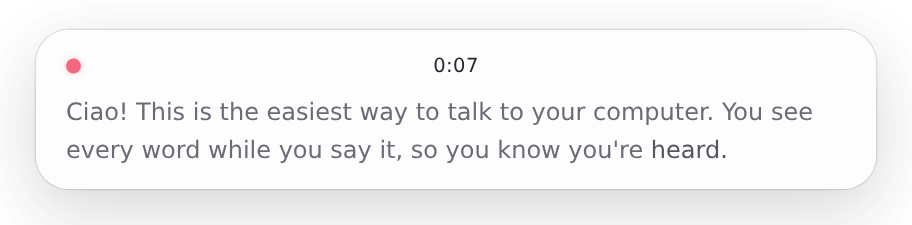

# Ciao

**See what you say while you say it.**

<picture>
  <source media="(prefers-color-scheme: dark)" srcset="assets/demo-dark.gif" />
  
</picture>

Ciao is a dictation app that shows your words live, as you speak, in a small
floating card at the bottom of the screen. When you let go of the key, the text
is pasted into the app you were typing in.

Other dictation tools show nothing until you stop talking. You only find out that
"don't" became "do" after the text has landed in your prompt. With Ciao you watch
the transcript form in real time and catch the one word that flips the meaning
while you are still talking. It is built for talking to coding agents (T3 Code,
Claude Code, Codex) in Russian and English mixed with technical terms.

## Features

- **Live preview.** New words fade in bright and settle to grey. On a real
  microphone they appear about 0.8 s after they are spoken (median), and that holds
  steady over multi-minute dictations. The final text arrives about 0.6 s after you
  release the key.
  - This is at the default recognizer delay of `low`. The level ranges from
    `minimal` to `xhigh`: lower shows words sooner, higher is more accurate, and the
    price is the same. It is hidden by default. To see and change it, go to
    *Settings → For developers → Show delay*.
- **Push to talk.** Hold **Right Ctrl** (**Right Option** on a Mac), speak, release, and the text is pasted.
  - The **middle mouse button** works the same way by default: click to start
    hands-free, click again to finish, or hold it to talk.
  - Any key, key combo or mouse button (middle, side buttons) can be a trigger;
    see [Hotkeys](#hotkeys).
  - Or just say **"ciao"** ("чао") to start hands-free (*Settings → Voice*, off by default).
    The word is spotted on your computer, so nothing is sent anywhere until you
    dictate: [Vosk](https://alphacephei.com/vosk/) hears it within ~0.2 s and
    [sherpa-onnx](https://github.com/k2-fsa/sherpa-onnx) keyword spotting double-checks
    the last second of audio, which filters near words like "чаю" or "чекаут".
    It costs about 10% of one CPU core and ~280 MB of memory, adds ~170 MB to the app,
    and the mic stays open while it is on.
  - Tapping for less than 0.35 s switches to hands-free mode: tap again to finish,
    or say **"ciao ciao"** ("чао-чао"; the words themselves are not pasted; toggle in
    *Settings → Voice*).
  - **Esc** cancels. Nothing is transcribed or pasted, but the recording stays in
    the history.
- **The card stays out of your way.**
  - Moving the pointer over it makes it see-through, so you can read what's
    underneath; scroll it and it turns solid again.
  - Drag the grip at its bottom edge to move it, and the corner to change its
    width. Double-click the grip to put it back at the bottom centre.
- **Pastes where you started.** The text goes into the window that was active when
  you pressed the key. If you switched away, nothing is typed anywhere and the text
  is left on the clipboard. After a successful paste, the clipboard is restored.
- **Paste the last transcript again** with **Alt+Shift+Z** (**Option+Shift+Z** on a Mac).
- **Nothing is lost.**
  - Audio is written to disk while you speak.
  - If the live connection drops, recording continues and the saved file is
    transcribed when you stop.
  - If that fails too (for example, you are still offline), nothing is pasted. The
    dictation is marked "not transcribed" in the history, where you can transcribe
    it later.
  - A dictation interrupted by a crash or restart is transcribed from its saved
    audio on the next start and shown on screen with a *Copy* button.
- **History.** Click the tray icon to see every dictation. You can play it, copy
  it, delete it, or transcribe it again:
  - **More accurate** re-runs the whole file through the file model
    (`gpt-transcribe` or `gemini-3.5-transcribe`).
  - **Live** re-runs it through the streaming model.
  - With keys for both services, *Via OpenAI / Gemini* next to these buttons
    picks the service for this recording (the one in Settings by default), and
    when a retry fails, *Try with …* runs it through the other one.
- **Paragraphs and lists, live.** The card lays the text out while you speak, and
  the pasted text has the same layout:
  - a long pause (1.2 s) before a new sentence starts a paragraph;
  - a sentence starting with "первое", "во-вторых", "третий момент"… starts a
    numbered item (the word itself is dropped); inside a list "и ещё", "дальше",
    "также" do too (in English: "first"… "third", "next", "also"), and only a
    longer pause (2 s) ends the list.
  - These are fixed rules, no model, so it costs no time. Toggle in
    *Settings → Behavior → Paragraphs and lists*.
- **Context** (Settings tab). Describe what you usually talk about and list the
  terms that must be spelled exactly (`T3 Code`, `WebSocket`, …). This noticeably
  improves product names and identifiers.
- **Sync through Google** (*Settings → Sync → Sign in with Google*, on every
  platform and on Android). The terms, the context and the API keys become the
  same on every device you sign in on. See [Sync](#sync).
- **English or Russian interface** (*Settings → Appearance → Language*). The
  default is Russian if the system is in Russian and English otherwise (also for
  an existing install, the first time it starts with this setting); a change
  applies right away.
- **Light, dark or system theme** (*Settings → Appearance*). System is the
  default and follows the system live.
- **Cost meter.** Shows how many cents the current dictation costs. You can turn
  it off in Settings.
- **OpenAI or Gemini** (*Settings → Recognition → Service* on the desktop,
  *Service* on Android). OpenAI is the default.
  With Google's Gemini (`gemini-3.5-transcribe-live` while you speak,
  `gemini-3.5-transcribe` for the file), live transcription costs about half as much,
  and **Apply spoken corrections** (on by default) cleans up the final text: it drops
  "um", false starts and repeats, and keeps only the correction when you change your
  mind ("в два, нет, в три" → "в три"; "at 1 pm, actually no, 2 pm" → "at 2 pm").
  While you speak the card shows the words as said, so a correction is applied
  only when the final text arrives, about 0.3 s after you let go. With corrections
  on, Gemini often breaks the text into paragraphs itself; then Ciao leaves its
  layout as it is, otherwise its own rules for lists apply as usual.
  - Gemini detects the language on its own and takes no free-form context, only
    the terms (*Settings → Recognition*), so the Languages and Context fields are
    hidden with it, and so is the delay level.
  - A Gemini live connection lasts about 10 minutes from when it opens, and Ciao
    opens it up to 2 minutes ahead, so a dictation longer than about 8 minutes
    may be transcribed from the saved audio when you stop instead.
  - Google's first paid tier takes about 6.5 minutes of audio a minute. *Live*
    in the history therefore sends a recording at 4× its speed with Gemini, one
    at a time, and *More accurate* waits and tries again when a long recording
    runs into the limit.

## Requirements

- Windows 10/11 (x64), macOS 13 or later (Apple Silicon or Intel; see
  [macOS](#macos)), Linux x64 (see [Linux](#linux)), or Android 8+ (see
  [Android](#android)). The macOS build is new: it has no wake word yet and
  updates by hand.
- An OpenAI API key with access to `gpt-live-transcribe` and `gpt-transcribe`, or a
  Gemini API key from [Google AI Studio](https://aistudio.google.com/apikey) (a
  project with billing on; new accounts prepay at least $5).

Pricing is per minute of audio:

| | live | re-transcribing the file |
| --- | --- | --- |
| OpenAI (`gpt-live-transcribe`, `gpt-transcribe`) | $0.017/min, about $1 per hour of talking | $0.0045/min |
| Gemini (`gemini-3.5-transcribe-live`, `gemini-3.5-transcribe`) | about $0.009/min | about $0.005/min |

Gemini bills per token; the per-minute figures are Google's own estimate for
speech. Idle time costs nothing.

## Install

### Windows

Download `Ciao-Setup-<version>.exe` from the
[latest release](https://github.com/iliyasone/ciao/releases/latest) and run it. It
installs for your user only (no admin prompt) into `%LOCALAPPDATA%\Programs\Ciao`
and starts Ciao. If you already run a copy you built yourself, quit it first
(tray → *Quit*); otherwise the new one hands over to it and exits.

1. The installer is unsigned, so SmartScreen may warn you: choose *More info → Run
   anyway*.
2. Ciao lives in the system tray. On first start the Settings tab opens: paste
   your API key there.
3. If nothing is recorded, allow microphone access for desktop apps. It is in
   Windows Settings → Privacy & security → Microphone.

Ciao starts with Windows by default. The toggle is in Settings.

### Updates

Ciao checks GitHub Releases for a newer version 15 s after it starts and every
4 hours after that. When there is one, an **Update to X** button shows in the
window's title bar and in the tray menu. Click it: the new version downloads,
Ciao quits, installs it silently and starts again. Settings, the key and the
history in `%APPDATA%\Ciao` stay. Nothing is downloaded until you click, and a
failed check in the background shows nothing.

To check by hand, go to *Settings → Updates → Check*.

On Linux the AppImage updates itself the same way; the `.deb` asks for your
password to install the new package. On macOS the check works the same, but the
button opens the release page instead: see [macOS](#macos).

A portable copy (the `release/win-unpacked` folder from `npm run dist:win`) is
updated the same way. The update installs Ciao into `%LOCALAPPDATA%\Programs\Ciao`,
and from then on that copy runs and starts with Windows. You can delete the old
folder. A dev run (`electron .`) never updates.

### macOS

Download from the [latest release](https://github.com/iliyasone/ciao/releases/latest):
`Ciao-<version>-arm64.dmg` for Apple Silicon (M1 and later), `Ciao-<version>-x64.dmg`
for Intel. Open it and drag Ciao into Applications.

1. The app is not signed with an Apple Developer ID, so macOS blocks the first
   start ("Apple could not verify…"). Click *Done*, open System Settings →
   Privacy & Security, scroll down and click *Open Anyway*. Or run
   `xattr -dr com.apple.quarantine /Applications/Ciao.app` in Terminal once.
2. Ciao lives in the menu bar; there is no Dock icon. On first start the Settings
   tab opens: paste your API key there.
3. Allow the microphone when asked, and turn Ciao on in System Settings → Privacy
   & Security → Accessibility. Without that, Ciao can't hear the dictation key or
   paste the text. *Settings → Permissions* shows whether it has it.
4. Hold **Right Option** to dictate (most Mac keyboards have no Right Control).
   The middle mouse button works too, and *Settings → Keys* takes any other key.

What is different on macOS for now:

- **No wake word.** Saying "ciao" to start isn't available yet.
- **Updates are by hand.** *Update to X* opens the release page. Quit Ciao (menu
  bar icon → *Quit*), download the new `.dmg` and drag Ciao into Applications over
  the old one. Because the app is unsigned, macOS then stops honouring the
  Accessibility permission even though the switch still shows on: remove Ciao from
  that list with **−**, press *Settings → Permissions → Open settings* to put it
  back, and turn it on again.
- **Paste goes to the app, not the window.** macOS tells Ciao which app is in front
  but not which of its windows, so switching to another window or tab of the same
  app still gets the text.
- **Keys that can't be heard.** While a password field (or a terminal with
  *Secure Keyboard Entry*) is focused, macOS hides keys from every app, Ciao too.

### Build it yourself

You need Node.js 22+, and the .NET 8 SDK for the Windows app. The Windows build
runs on Windows, Linux or macOS.

```sh
git clone https://github.com/iliyasone/ciao.git
cd ciao
npm install
npm run build:native        # the input helper → build/win-input/Ciao.Input.exe
npm run build:kws           # the wake-word detector and model (~50 MB) → build/kws
npm run dist:win            # a portable folder → release/win-unpacked/Ciao.exe
npm run dist:win:installer  # the installer → release/Ciao-Setup-<version>.exe
```

`dist:win` needs nothing else. `dist:win:installer` needs Wine on Linux and macOS
(NSIS uses it for the uninstaller). On Windows it needs nothing extra.

The macOS app builds on a Mac only, with Xcode's command line tools
(`xcode-select --install`) instead of .NET:

```sh
npm run build:native:mac    # the input helper → build/mac-input/Ciao.Input
npm run dist:mac            # disk images → release/Ciao-<version>-{arm64,x64}.dmg
```

The Linux app is built on Linux, without Wine or .NET:

```sh
npm run build:kws:linux     # the wake-word detector and FFI for Linux → build/kws
npm run dist:linux          # → release/Ciao-<version>.AppImage and .deb
```

There the input helper is [`src/linux-input`](src/linux-input), plain Node run by
Electron, which speaks the same protocol as the Windows one.

### Linux

Download `Ciao-<version>.AppImage` (any distribution) or `Ciao-<version>.deb`
(Debian, Ubuntu) from the
[latest release](https://github.com/iliyasone/ciao/releases/latest).

```sh
chmod +x Ciao-*.AppImage && ./Ciao-*.AppImage   # or: sudo apt install ./Ciao-*.deb
sudo usermod -aG input $USER                    # then sign out and back in
```

Ciao reads the keyboard and mouse from `/dev/input`, which works the same on X11
and Wayland, so you need to be in the `input` group. Without it Ciao says so
at start and only the wake word starts a dictation.

How it differs from Windows:

- **Keys are not hidden from other apps.** The app in front sees the trigger key
  too, so the default is Right Ctrl alone. A middle-click trigger is off by
  default, because the middle click would also paste the selection under the
  pointer. During a dictation Esc is held back from the app in front on X11, but
  on Wayland it gets through.
- **X11** works fully: Ciao pastes with Ctrl+V (Ctrl+Shift+V in terminals) and
  only into the window you started in.
- **Wayland** gives no app a way to see which window is active, so the text is
  pasted into whatever is in front when you finish, always with Ctrl+V. To type
  it, Ciao needs a virtual keyboard through `/dev/uinput`; allow that once:

  ```sh
  echo 'KERNEL=="uinput", GROUP="input", MODE="0660", OPTIONS+="static_node=uinput"' | sudo tee /etc/udev/rules.d/60-ciao-uinput.rules
  sudo udevadm control --reload && sudo udevadm trigger /dev/uinput
  ```

  Without it the text stays on the clipboard.
- The Ciao windows run through XWayland on Wayland, so the card can stay at the
  bottom of the screen above everything. On a Wayland desktop Ciao restarts
  itself once at launch with `--ozone-platform=x11`; pass `--ozone-platform=…`
  yourself to choose otherwise.
- The tray icon needs AppIndicator support (on GNOME, the *AppIndicator and
  KStatusNotifierItem Support* extension). *Start when you sign in* writes
  `~/.config/autostart/ciao.desktop`.

### API key

Ciao takes the OpenAI key from the `OPENAI_API_KEY` environment variable and the
Gemini key from `GEMINI_API_KEY`. If that is not set, it reads `openai-key.txt` or
`gemini-key.txt` in the [data folder](#where-things-are-stored). Saving a key in
Settings writes that file; the key card shows the service chosen in
*Settings → Recognition*.

### Hotkeys

Set them in *Settings → Keys*.

- **Dictation triggers.** Click *Add* and press what you want: a key (Right
  Ctrl on its own works), a combo such as Ctrl+Alt+Space, or a mouse button
  (middle, side buttons, optionally with modifiers). You can have several.
- **What other apps see.**
  - Keys and mouse buttons bound this way are hidden from other apps.
  - A lone modifier such as Right Ctrl is the exception, so Ctrl+C keeps working.
- **Paste last.** Click the shortcut and press a new combo.

On macOS, Option is `Alt` and Command is `Win` in these names, and the Fn key is
`Fn`.

In `config.json` these are:

- `triggers` — `+`-separated modifiers (`Ctrl`, `Alt`, `Shift`, `Win`), then a
  [.NET `Keys`](https://learn.microsoft.com/dotnet/api/system.windows.forms.keys)
  name or `MButton` / `XButton1` / `XButton2`.
- `pasteLastHotkey` — an
  [Electron accelerator](https://www.electronjs.org/docs/latest/api/accelerator).

## Android

The Android app works like Wispr Flow: whenever the keyboard is open over a text
field, the Ciao icon floats above it. Tap it and speak. The card at the top of the
screen shows your words live, the same way as on the desktop (bright new words,
paragraphs and lists). Tap the icon again, or say **"ciao ciao"** ("чао-чао"), and
the text is typed into the field. It works with any keyboard; Ciao doesn't replace
yours.

- **Hold** the icon to talk while you hold it; let go to finish.
- **Drag** it to move it, or throw it. It glides to the nearer side and stays at
  that height above the keyboard.
- The icon appears once the keyboard has finished opening, and it rests above the
  keys, not on them. While the keyboard is still moving, taps go through the icon,
  so a tap aimed at a key never starts a dictation.
- **✕** on the card cancels; **✓** finishes.
- If the field won't take the text, it is copied to the clipboard instead.
- If the live connection drops, recording continues and the audio is sent to
  the file model (`gpt-transcribe`, or `gemini-3.5-transcribe`) when you finish.
  If that fails too (still offline), the card keeps the recording with a
  *Transcribe again* button until you dismiss it.
- **OpenAI or Gemini**: pick the service at the top of the Ciao screen; the key
  field below it is for that service's key. With Gemini, *Apply spoken
  corrections* works as on the desktop ([Features](#features)), the context field
  isn't used, and the language is detected on its own.

### Install on Android

1. Download `Ciao-<version>.apk` from the
   [latest release](https://github.com/iliyasone/ciao/releases/latest) on the phone
   and open it. Allow installing apps from that source if Android asks.
2. Open Ciao, pick OpenAI or Gemini and paste that service's API key.
3. Allow the microphone.
4. Tap *Open Accessibility settings* and turn on **Ciao dictation**. Ciao uses the
   accessibility service to see when a keyboard is open and to type into the
   field; it reads only the focused field and sends nothing but your audio to the
   service you picked.
   - If the switch is greyed out (Android 13+ does this for apps installed from a
     file), open *App info*, tap **⋮** in the corner, choose *Allow restricted
     settings*, and try again.
5. Try it in the field at the bottom of the Ciao screen.

Terms are one per line, as on the desktop, and *Sign in with Google* syncs them,
the context and the API keys (OpenAI and Gemini) with your other devices
([Sync](#sync)). Signing in needs Google Play services. The service picked stays
per device, as on the desktop.

*Open history* lists every dictation, newest first, with a search: tap one to
copy it, hold it to share it, transcribe its recording again (with the service
picked now) or delete it. A dictation that failed, or that you cancelled, stays
there with its recording. The recordings of the newest 200 dictations are kept
(about 3 MB a minute); older ones keep only their text. The history stays on the
phone: it isn't synced and has no playback yet.

The Android app has no wake word or usage counts yet.

### Updates on Android

The APK from GitHub updates itself from the same
[releases](https://github.com/iliyasone/ciao/releases) as the desktop app. Each
time you open the Ciao screen (at most every 4 hours) it checks for a newer
version; when there is one, a card at the top offers *Update to X* and *What's
new*. To check by hand, tap *Check for updates* at the bottom of the screen.

*Update* downloads the APK and hands it to Android, which asks you to confirm and
installs it over the old one; your settings stay. The first time, Android asks you
to let Ciao install apps (*Install unknown apps*); turn it on and come back, and
the update continues. Nothing is downloaded until you tap *Update*. Android only
accepts an update signed with the same key, so a tampered APK is refused.
Installing a newer APK by hand works too.

## Sync

Sign in with Google (*Settings → Sync* on the desktop, *Sync with Google* on
Android) and your terms, context and API keys are the same on every device signed
in with that account: on a new device, signing in is all the setup. There is no Ciao server: they're kept in one file,
`ciao-sync.json`, in the hidden app folder of your own Google Drive. Ciao asks
only for that folder (`drive.appdata`, which can't see any other file in your
Drive) and your email address, to show which account is signed in. Google's page
lists Drive access as a box to tick, unticked at first: tick it, or Ciao says it
has no access.

- What syncs: the terms, the context and the API keys (OpenAI and Gemini).
  Nothing else: not the other settings, not the history.
- *Sync API keys* is on by default. The keys sit in the file as they are, so
  anyone who can sign in to your Google account can read them. Turned off on any
  device, it turns off everywhere (the switch syncs too): every device keeps its
  own keys, and the next sync removes them from Drive. A key from
  `OPENAI_API_KEY` / `GEMINI_API_KEY` is never synced, only one saved in Settings.
- When: right after you change them, when you come back to the settings window
  (the app on Android), every 5 minutes on the desktop, and on Android when the
  keyboard shows up, at most every 10 minutes.
- Merging: each device remembers when every term was added or removed. A term
  added on one device survives a save on another, and a removed one doesn't come
  back. For the context, each key and the switch, the later edit wins. Each device keeps that history in
  `sync-state.json` (desktop) or its preferences (Android).
- Signing out stops syncing on that device and keeps the terms there; the other
  devices stay signed in. To take Ciao's access away everywhere, remove it from
  [your Google account's third-party connections](https://myaccount.google.com/connections);
  to delete the file too, remove Ciao's data in
  [Google Drive → Settings → Manage apps](https://drive.google.com/drive/settings).

Privacy policy: [sayciao.vercel.app/privacy.html](https://sayciao.vercel.app/privacy.html).
The Google Cloud project is `ciao-510802`. The desktop app gets its OAuth client
at build time from `CIAO_GOOGLE_CLIENT_ID` and `CIAO_GOOGLE_CLIENT_SECRET`
(GitHub secrets in CI); built without them, it has no *Sync* card. The Android
app needs nothing: Google knows it by its package name and signing key, so a
build signed with another key can't sign in.

## Where things are stored

Everything is under `%APPDATA%\Ciao` on Windows, `~/Library/Application Support/Ciao`
on macOS and `~/.config/Ciao` on Linux:

- `config.json` — settings. Most of them are edited in the app.
- `openai-key.txt`, `gemini-key.txt` — the API keys.
- `history\<id>\` — one folder per dictation, holding `audio.wav` and
  `entry.json` (transcripts, timings, cost, where it was pasted). The `<id>`
  starts with the UTC start time, `YYYYMMDD-HHMMSS`. The **Folder** button in the
  history window opens it.
- `ciao.log` — the app log.
- `telemetry-id` — the random install id for [anonymous usage counts](#telemetry).
- `google-account.json` — the Google account for [sync](#sync): its email and
  refresh token, encrypted with the system keychain where there is one.
- `sync-state.json` — every term change this device knows, for merging.

Recordings and transcripts stay on your machine. Audio leaves it only to be
transcribed by OpenAI or Google, whichever you chose.

## Telemetry

Ciao sends anonymous usage counts to [PostHog](https://posthog.com) (EU cloud), so
we can see how many people use it. Two events:

- `app_started`: app version, OS version, CPU architecture, the transcription
  service (`provider`: `openai` or `gemini`), and whether its API key is set and the
  wake word and paragraph layout are on.
- `dictation`, once per dictation kept in the history:
  - how it ended: `outcome` (pasted, clipboard, empty, failed, cancelled) and
    `transcribed_by` (`live`; `file` when the live transcript failed and the saved
    audio was sent instead; `none` when nothing was transcribed, as on Esc);
  - how it was driven: `trigger` (the key or button that started it, such as
    `RControlKey` or `MButton`, or `wake_word`), `ended_by` (release, press,
    `stop_phrase`, escape, `mic_error`) and `hands_free`;
  - who transcribed it: `provider` (`openai` or `gemini`) and, with Gemini, `smart`
    (whether spoken corrections were applied);
  - time and money: `duration_s`, `voice_onset_ms` (not for wake-word starts, whose
    audio begins with speech), `first_text_ms`, `final_after_release_ms` and `cost_usd`;
  - where the text went: `target_app`, the kind of app it was meant for, from a
    closed list in [`src/core/apps.ts`](src/core/apps.ts) (`t3code`, `vscode`,
    `terminal`, `browser`, `telegram`, …). Any program not on the list is sent as
    `other`, never by name. When the text could not be pasted,
    `paste_miss` says why: `focus-changed`, `no-target`, `auto-paste-off`,
    `no-permission` (macOS: Ciao has no Accessibility permission), or
    `no-helper` / `timeout` / `unknown` when the input helper failed. On
    `focus-changed` there are also `switched_to_app` (the app in front instead, same list),
    `target_closed`, and `target_on_other_desktop` (true when you switched to another
    virtual desktop; absent when Windows can't tell).

Each event carries a random install id from `telemetry-id` in the [data folder](#where-things-are-stored). It is
not derived from your machine or accounts. No text, audio, window titles, prompts,
terms or API keys are ever sent. PostHog keeps no person profiles for these events, does
not look up a location from your IP address, and the project discards IP addresses.

To turn it off, use *Settings → Behavior → Anonymous usage stats* (*Настройки → Поведение → Анонимная статистика* in Russian), or set
`CIAO_TELEMETRY=0`. An unpackaged dev run (`electron .`) sends nothing unless
`CIAO_TELEMETRY=1`. `CIAO_POSTHOG_KEY` and `CIAO_POSTHOG_HOST`
point it at your own PostHog project.

## Development

### Releasing

Every release ships all the apps under one version, the one in `package.json`
(the Android build reads it from there too):

1. Merge everything that goes in into `main` and wait for CI to pass.
2. On `main`, run `npm version 0.5.0 -m "Release %s" && git push --follow-tags`.
   `npm version` bumps `package.json` and `package-lock.json`, commits
   "Release 0.5.0" and tags `v0.5.0`; pushing the tag starts the release.
3. Watch the *Release* run. When it is green, the release is published. Its notes
   are generated from the merged PRs; edit them on GitHub if a platform needs a
   word of its own.

[`release.yml`](.github/workflows/release.yml) creates a draft GitHub release, then
four jobs upload into it at the same time:

| Job | Runner | Files |
| --- | --- | --- |
| `windows` | Windows | `Ciao-Setup-<version>.exe`, its `.blockmap`, `latest.yml` |
| `mac` | macOS | `Ciao-<version>-{arm64,x64}.dmg`, `.zip`s, their `.blockmap`s, `latest-mac.yml` |
| `linux` | Ubuntu | `Ciao-<version>.AppImage`, `Ciao-<version>.deb`, `latest-linux.yml` |
| `android` | Ubuntu | `Ciao-<version>.apk` |

Installed desktop copies check `latest.yml` / `latest-mac.yml` / `latest-linux.yml`
of the latest published release, so the draft is published only after all four jobs
succeed.
If one fails, rerun the failed jobs: they fill the same draft.

- The tag must equal `v` + the `package.json` version, or the workflow fails.
- The APK is signed with the release key from the repository secrets
  (`CIAO_KEYSTORE_BASE64`, `CIAO_KEYSTORE_PASSWORD`, `CIAO_KEY_ALIAS`,
  `CIAO_KEY_PASSWORD`). Every release must be signed with that key, or Android
  refuses to install it over the previous one.

[`ci.yml`](.github/workflows/ci.yml) builds the same installer, disk images,
AppImage, `.deb` and APK on every PR and attaches them to the run as artifacts. On
macOS it also checks that the input helper answers and that the packaged app is
signed and starts.

### Testing without speaking

While Ciao is running, run `Ciao.exe --replay=C:\path\to\clip.wav`. The clip plays
through the live pipeline in real time: it shows in the card and is saved to the
history, but nothing is pasted. Make a compatible clip with:

```sh
ffmpeg -i input.m4a -ar 24000 -ac 1 -sample_fmt s16 clip.wav
```

### How it works

```
mic ─► AudioWorklet (24 kHz PCM16, 40 ms chunks)            overlay renderer
          │
          ▼
       main process ──► history/<id>/audio.wav              written first, always
          │
          └──► OpenAI Realtime, gpt-live-transcribe, or Gemini Live,
               gemini-3.5-transcribe-live (WebSocket, opened in advance)
                  │ transcript deltas ──► overlay card (live text)
                  │ on key release: commit ──► final transcript
                  ▼
       Ciao.Input ──► Ctrl+V (⌘V) into the window that was active at the start
```

- A WebSocket session is kept open in reserve, because opening one takes up to a
  second and speech would otherwise start streaming late. An idle session costs
  nothing.
- Gemini sends a guess of the whole text so far, revised as you speak, rather than
  new words only; the card fades in whatever changed. Its voice detection is off,
  so a pause to think doesn't end the dictation: the key decides.
- If the final transcript does not arrive, the saved WAV is sent to
  `gpt-transcribe` (or `gemini-3.5-transcribe`) instead.
- `Ciao.Input` is a tiny native helper: .NET on Windows, Swift on macOS. It
  installs a low-level keyboard and mouse hook (an event tap on macOS), so it can
  see Right Ctrl being held and swallow Esc (the focused app never receives it).
  It also reports the foreground window and injects Ctrl+V. It talks to the
  Electron app over stdin/stdout, one JSON object per line; both helpers speak the
  same protocol (`src/main/input.ts`).

### Project layout

- `src/core/` — platform-neutral TypeScript with no Electron or Node imports: the
  live transcription sessions (`realtime.ts` for OpenAI, `gemini.ts` for Gemini,
  `providers.ts` for which models each uses), PCM/WAV helpers, prices and shared types. It is
  meant to be reused as-is by other shells (a T3 Code integration, mobile).
- `src/main/` — the Electron main process:
  - `dictation.ts` — the hotkey state machine and the pipeline;
  - `history.ts` — storage and crash recovery;
  - `transcribe.ts` — live and file transcription;
  - `paste.ts` — clipboard-preserving paste;
  - `input.ts` — talks to the keyboard and paste helper of the system;
  - `updater.ts` — updates from GitHub Releases;
  - `sync.ts` — Google sign-in and syncing through Drive; the merging is in
    `src/core/sync.ts`.
- `src/renderer/` — React 19 + Tailwind 4:
  - `overlay/` — the live card and microphone capture;
  - `history/` — the history and settings window.
- `src/preload/` — the IPC bridge exposed to the renderer as `window.ciao`.
- `native/win-input/` — the Windows keyboard and paste helper (C#).
- `src/linux-input/` — the Linux one, with the same protocol: evdev for the keys,
  X11 (libX11/libXtst through koffi) for the active window and Ctrl+V, uinput for
  Ctrl+V on Wayland. Electron runs it as plain Node.
- `native/mac-input/` — the macOS one (Swift), same protocol: an event tap for
  the keys, the frontmost app and ⌘V.
- `assets/icon.svg` — the icon. `scripts/build-icons.sh` renders the PNG, ICO and
  tray icons from it; don't edit those by hand.
- `site/` — the landing page, [sayciao.vercel.app](https://sayciao.vercel.app), and
  `privacy.html`, the privacy policy Google's sign-in screen links to: static
  HTML, deployed with `vercel deploy --prod` from `site/`. Its card
  demo is also the GIF at the top of this README: `node site/record-demo.mjs`
  re-records `assets/demo-*.gif`.

- `android/` — the Android app (Kotlin; its dependencies are OkHttp and Google
  Play services' sign-in):
  - `CiaoService.kt` — the accessibility service: the icon over the keyboard
    (`Spring.kt` moves it), the dictation pipeline, typing into the field;
  - `CardView.kt` — the live card;
  - `History.kt`, `HistoryActivity.kt` — the history, stored as on the desktop
    (`src/main/history.ts`), one folder per dictation, and its screen;
  - `Realtime.kt`, `Gemini.kt`, `FileTranscriber.kt` — the same OpenAI and
    Gemini calls as `src/core/realtime.ts`, `src/core/gemini.ts` and
    `src/main/transcribe.ts`; `Revision.kt` — the port of `src/core/revision.ts`,
    whose test holds its TypeScript outputs;
  - `Updater.kt` — updates from GitHub Releases through Android's package
    installer, like `src/main/updater.ts`;
  - `LiveLayout.kt`, `VoiceCommands.kt` — ports of `src/core/liveLayout.ts` and
    `src/core/voiceCommands.ts`. Their unit test holds the TypeScript outputs, so
    change both together;
  - `Sync.kt` — the port of `src/core/sync.ts`, with the same kind of test;
    `GoogleSync.kt` — sign-in and the Drive calls of `src/main/sync.ts`.

`npm run typecheck` checks the desktop app. For Android you need JDK 17 and the
Android SDK (platform 35); `cd android && ./gradlew assembleRelease` builds
`app/build/outputs/apk/release/Ciao-<version>-release.apk`, and
`./gradlew testReleaseUnitTest` runs the tests. Without
`android/keystore.properties` (`storeFile`, `storePassword`, `keyAlias`,
`keyPassword`) the APK is signed with your debug key.

## Roadmap

- Built-in dictation and read-aloud in [T3 Code](https://github.com/pingdotgg/t3code).
  The stack is the same (Electron, React, Tailwind, Vite), so the UI and the core
  can move into it.
- The wake word and signed, self-installing updates on macOS
  ([#4](https://github.com/iliyasone/ciao/issues/4)).

## License

MIT
